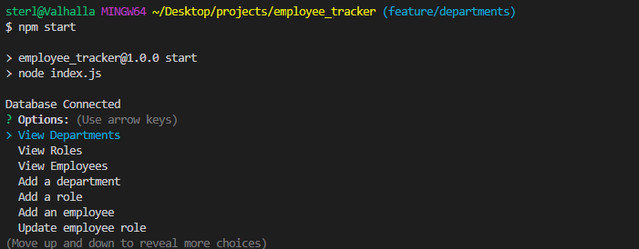

# Employee Tracker

https://github.com/sterlingpeck/Employee Tracker

# Description

Tracks employee database. Managers, employees, departments etc.

# Screenshot

# Table of Contents

- [Installation](#installation)
  Inquirer, MYSQL2, Console Table
- [Usage](#usage)
  Initialize SQL databases, npm start.
- [License](#license)
  N/A
- [Credits](#credits)
  N/A
- [Questions](#questions)
  peck.sterling@gmail.com

# Installation

These dependencies need to be installed to run this application: Inquirer, MYSQL2, Console Table

# Usage

In order to use this app, Initialize SQL databases, npm start.

# License

This project is licensed under N/A.

ISC License

Copyright (c) [2022] [sterlingpeck]

Permission to use, copy, modify, and/or distribute this software for any
purpose with or without fee is hereby granted, provided that the above
copyright notice and this permission notice appear in all copies.

THE SOFTWARE IS PROVIDED "AS IS" AND THE AUTHOR DISCLAIMS ALL WARRANTIES WITH
REGARD TO THIS SOFTWARE INCLUDING ALL IMPLIED WARRANTIES OF MERCHANTABILITY
AND FITNESS. IN NO EVENT SHALL THE AUTHOR BE LIABLE FOR ANY SPECIAL, DIRECT,
INDIRECT, OR CONSEQUENTIAL DAMAGES OR ANY DAMAGES WHATSOEVER RESULTING FROM
LOSS OF USE, DATA OR PROFITS, WHETHER IN AN ACTION OF CONTRACT, NEGLIGENCE OR
OTHER TORTIOUS ACTION, ARISING OUT OF OR IN CONNECTION WITH THE USE OR
PERFORMANCE OF THIS SOFTWARE.

# Credits

Credits: N/A

# Questions

If you have any questions please feel free to contact peck.sterling@gmail.com.
